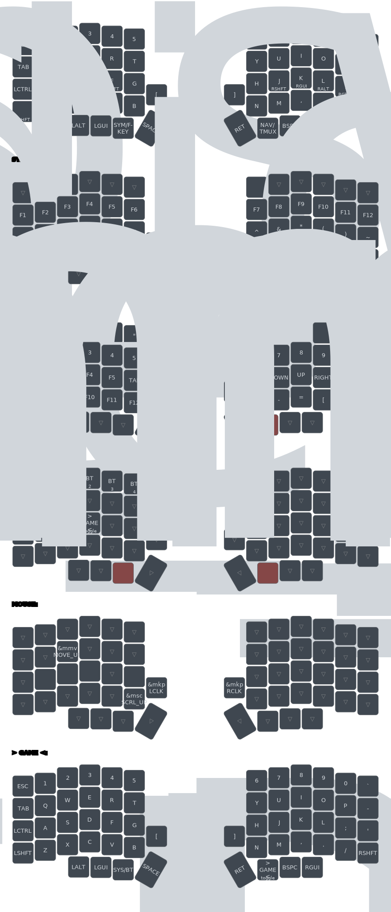

## My shop keyboard-hoarders.com and keyboardhoarders.etsy.com

# Keymap

Visual diagram of all keyboard layers (auto-generated on every keymap change):

**Downloads:**
- [View SVG](keymap-drawer/lily58.svg) (embeddable, scalable)
- [Download PDF](../../releases/latest) (printable, available in latest release)
- [View YAML](keymap-drawer/lily58.yaml) (parsed keymap data)
